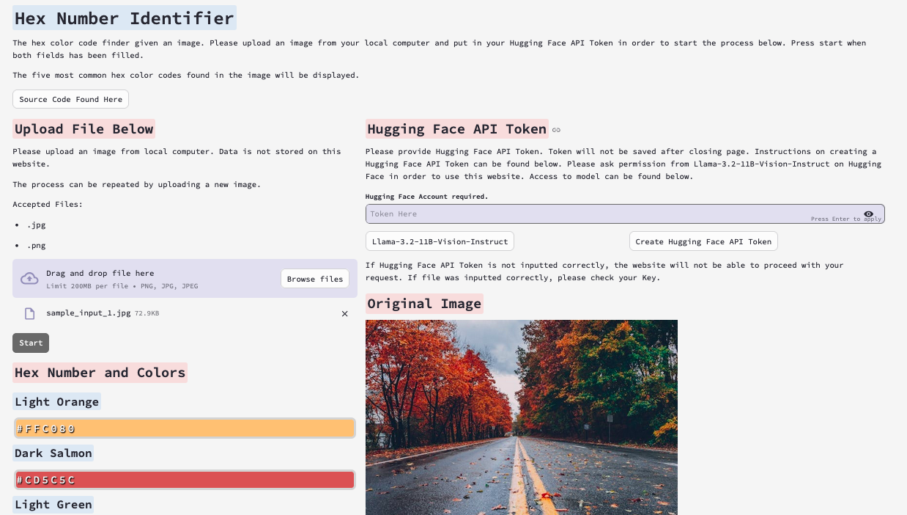
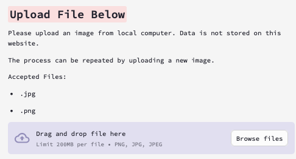
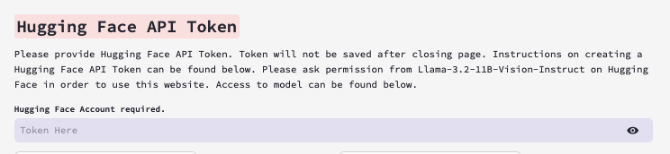
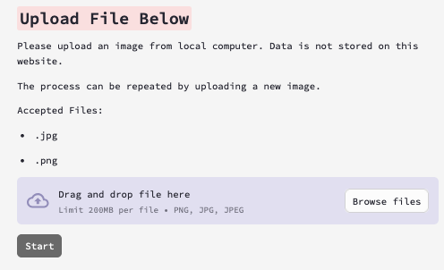
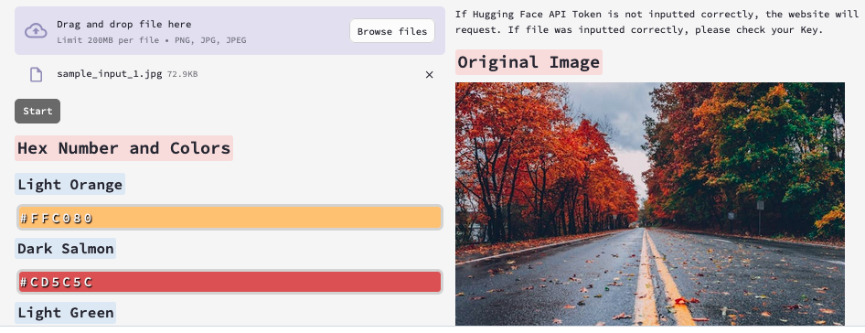

# Hex Identifier

## Overview

Runs a website page that identifies and returns the five most common Hex Color Codes from an image given by the user. It uses the Large Language Model, **Meta's Llama-3.2-11B-Vision-Instruct Model** to identify the Hex Color Codes. 

**Hugging Face's account is required.**




## Table of Contents

 - [Getting Started](#getting-started)
    - [Prerequisites](#prerequisites)
    - [Installing](#installing)
- [Run](#run)
    - [Usage of Website](#usage-of-website)
- [Resources](#resources)

## Getting Started

### Prerequisites

This program uses: 
- Python 3.13.1.

1) Create a Free API Key at [Hugging Face](https://huggingface.co/).
2) Ask permission for usage of model  [Llama-3.2-11B-Vision-Instruct](https://huggingface.co/meta-llama/Llama-3.2-11B-Vision-Instruct") on Hugging Face in order to use this Streamlit application.

### Installing

1) Clone the repository.
   ```sh
    $ git clone https://github.com/nerutoki/HexIdentifier.git
    $ cd HexIdentifier
    ```

2) Create an virtual environment in your terminal.
    ```sh
    $ python3 -m venv env 
    $ source env/bin/activate
    ```

3)
    Install the required packages.
    ```sh
    $ pip install uv
    $ uv pip -r requirements.txt
    ```

## Run

Run the code below in your terminal. A website page should appear shortly in your browser after executing the code.

```sh
$ streamlit run streamlit_app.py
```

### Usage of Website

1) Attach your image to the file uploader. If the image is not a PNG or JPEG/JPG file, it will not run.



2) Enter your Hugging Face API Key.



3) Click "Start" when both fields are filled. If program fail to start, please check if both fields were filled correctly.



4) Example output.




## Resources
- Sample image is from Craig Adderley at Pexels https://www.pexels.com/photo/concrete-road-between-trees-1563356/ .
- file_to_data_url function is from https://huggingface.co/mistralai/Pixtral-12B-2409/discussions/6
- The Large Language Model, Meta Llama-3.2-11B-Vision-Instruct, https://huggingface.co/meta-llama/Llama-3.2-11B-Vision-Instruct is used.
- Create Free Hugging Face Token at https://huggingface.co/ 